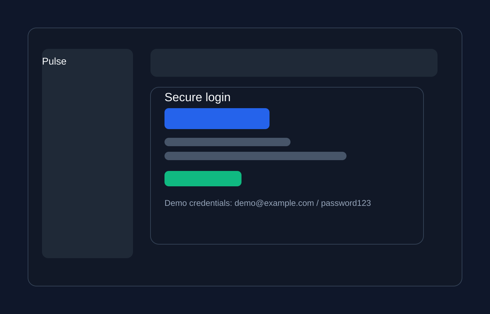
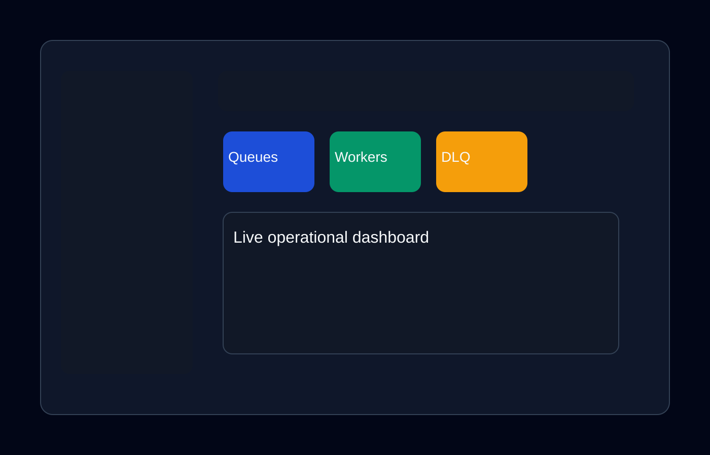
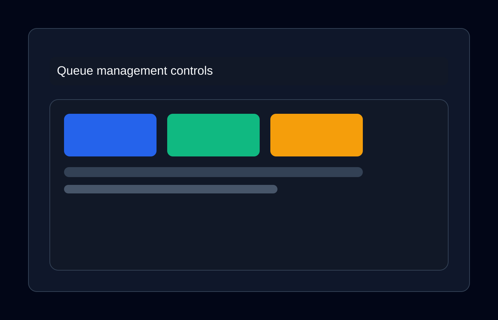
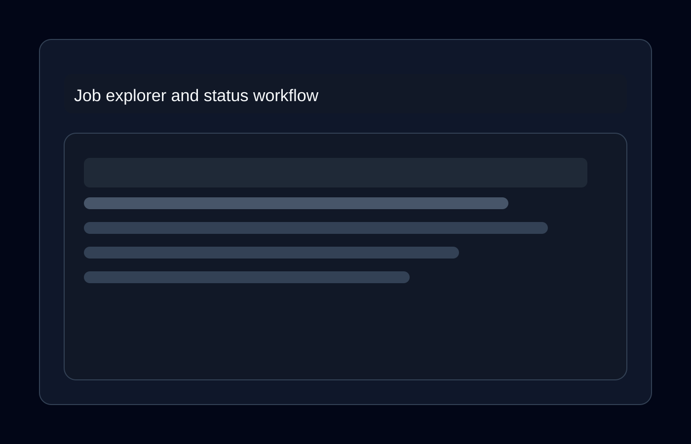
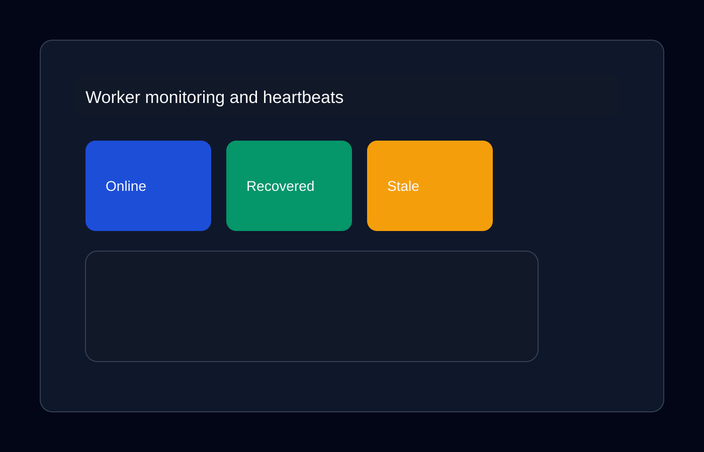
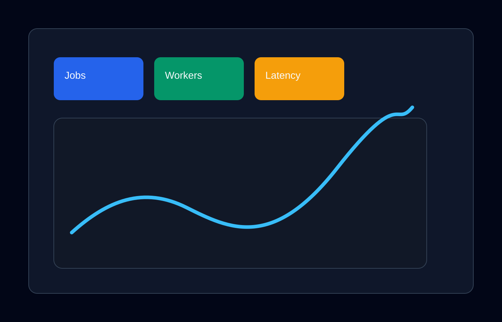
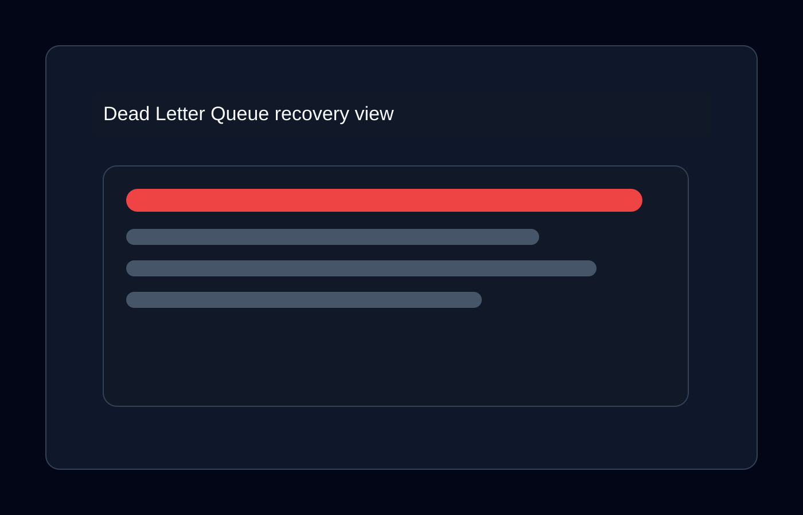

# Pulse — Distributed Job Scheduler

Repository reference: RA2311003010335

Pulse is a production-inspired distributed job scheduler built with Node.js, TypeScript, Express, PostgreSQL, Redis, WebSockets, and React. It demonstrates atomic job claiming, fault-tolerant worker execution, retry policies, dead-letter recovery, RBAC, and real-time monitoring in a single academic-ready project.

## Project overview

This project implements a horizontally scalable scheduler with:
- stateless API nodes
- a scheduler leader process
- multiple worker processes
- a live dashboard for queue and job operations
- PostgreSQL as the source of truth
- Redis for coordination, locking, and rate limiting

## Features

- Immediate, delayed, scheduled, recurring, and batch job types
- Atomic claiming using PostgreSQL row locking with SKIP LOCKED
- Fixed, linear, and exponential backoff retry policies with jitter
- Dead Letter Queue with replay support
- Worker heartbeat monitoring and orphan job recovery
- RBAC for organizations and projects
- WebSocket-powered live updates for queues, jobs, and workers
- Metrics endpoint for operational visibility

## Screenshots















## Architecture and diagrams

- [High-level architecture diagram](docs/diagrams/High-Level%20Architecture%20Diagram.png)
- [Component diagram](docs/diagrams/Component%20Diagram.png)
- [Sequence diagram](docs/diagrams/Sequence%20Diagram.png)
- [Deployment diagram](docs/diagrams/Deployment%20Diagram.png)
- [ER diagram](docs/diagrams/ER%20Diagram.png)
- [Architecture diagram](docs/architecture-diagram.svg)
- [ER diagram](docs/er-diagram.svg)
- [Deployment diagram](docs/deployment-diagram.svg)
- [Sequence diagram](docs/sequence-diagram.svg)
- [API documentation](docs/api-docs.md)
- [Design decisions](docs/design-decisions.md)

## Technology stack

- Backend: Node.js 20 + TypeScript + Express
- Database: PostgreSQL 16
- Coordination: Redis 7
- Real-time: Socket.io
- Frontend: React 18 + Vite + Tailwind CSS
- Testing: Vitest

## Repository structure

```text
RA2311003010335/
├── backend/           API, worker runtime, scheduler, tests
├── frontend/          React dashboard
├── db/                SQL schema and migration assets
├── docs/              screenshots, diagrams, API docs
├── docker-compose.yml
├── LICENSE
├── README.md
└── .gitignore
```

## Installation

### Docker (recommended)

```bash
docker compose up --build
```

Then initialize demo data:

```bash
docker compose exec api npm run seed
```

Access:
- Dashboard: http://localhost:5173
- API: http://localhost:4000
- Demo login: demo@example.com / password123

### Manual setup

```bash
# 1. Database
createdb job_scheduler

# 2. Backend
cd backend
cp .env.example .env
npm install
npm run migrate
npm run seed
npm run dev

# 3. Worker
WORKER_QUEUE_ID=<queue-id> npm run worker

# 4. Scheduler leader
npm run scheduler

# 5. Frontend
cd ../frontend
cp .env.example .env
npm install
npm run dev
```

## Running tests

```bash
cd backend
npm test
RUN_INTEGRATION=1 npm test
```

## Future improvements

- Add Kubernetes deployment manifests
- Introduce container health and observability dashboards
- Expand automated integration coverage
- Improve production secrets and deployment hardening

## License

This project is licensed under the MIT License. See [LICENSE](LICENSE).
